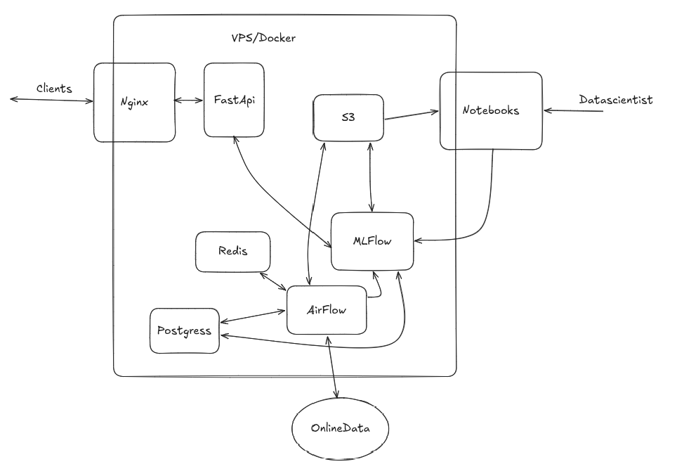
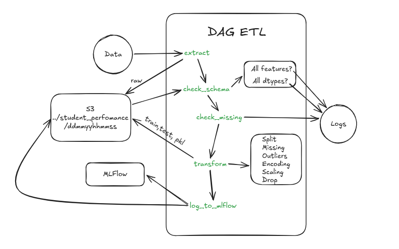

### MLOPS1 - CEIA - FIUBA

## Integrantes

- Rubiolo, Pedro Ignacio
- Tolotto, Lourdes Sofia
- Bettig, Santiago Federico
- Dieguez, Manuel

En este repositorio se pretende implementar un servicio de ML para predecir el rendimiento de los estudiantes, utilizando un [dataset de Kaggle](https://www.kaggle.com/datasets/harshadapatil31/student-performance-and-study-habits-dataset/data). El dataset fue subido a [Google Drive](https://drive.google.com/file/d/1r1vNWVotPfX1tpA26jKE7CBpDzeUNGMr/view?usp=sharing) para que sea mas facil su acceso, no es necesario descargarlo directamente ya que sera obtenido por el DAG de ETL.



La implementación incluye:

- MLFlow
  - Se utiliza para llevar un seguimiento de los experimentos, modelos y artefactos. Es usado por distintos servicios del sistema, como Apache Airflow y los Notebooks.

- Apache Airflow
  - Un DAG que obtiene los datos desde google drive, lo verifica, realiza limpieza, escalamiento y encoding y guarda en el bucket los datos separados para entrenamiento y pruebas asi como su procesador de Sklearn. MLflow hace seguimiento de este procesamiento.
  - Un DAG (`train_student_performance.py`) que, dado un nuevo conjunto de datos, reentrena el modelo (Regresión Logística con búsqueda de hiperparámetros vía Optuna). Compara el nuevo modelo contra el champion actual usando `f1_weighted`, y si lo supera, lo reemplaza. Todo se registra en MLflow, incluyendo el path al preprocesador (`preprocessor_s3_path`) que usó ese entrenamiento.

- Jupiter Notebooks
  - Un notebook que corre de manera local, que se conecta al data lake para extraer los datos, permitiendo automaticamente seleccionar los mas recientes o un directorio especifico, realiza busqueda de hiperparámetros para una Regresion Logistica con Optuna. Todo el experimento se registra en MLflow, indicando datos utilizados, resultados de cada Trial de Optuna, mejores parametros, metricas y graficas. Además, se registra el modelo en el registro de modelos de MLflow.

- FastAPI
  - Un servicio de API que sirve las predicciones del modelo `champion` registrado en MLflow. Al arrancar (y luego periódicamente, ver [API](#api)) carga el modelo y su preprocesador correspondiente, y expone endpoints de predicción individual y en batch.

- Nginx
  - Un webserver que sirve el frontend (HTML/CSS/JS plano, sin build step) para interactuar con el modelo y actúa como reverse proxy hacia FastAPI, todo detrás de un mismo puerto (8081).

- Minio
  - Un data lake donde almacenamos datos crudos, procesados, modelos y artefactos.

- Valkey
  - Servicio usado internamente por Airflow (Celery broker). No se usa como cache de aplicación.

- Postgress
  - Utilizado por Apache Airflow y MLFlow para almacenar metadatos.

## Testeo de Funcionamiento

El orden para probar el funcionamiento completo es el siguiente:

1. Levantar todo con `docker compose --profile all up -d --build`.
2. Ejecutar el DAG de ETL en Airflow llamado `process_etl_student_performance`. Esto descargara el dataset y almacenara en el bucket la version cruda y la version procesada con su division en Train y Test asi como su procesador de Sklearn. Una vez finalizado, este dispara la ejecución del DAG `train_student_performance`.
3. Esperar que termine de ejecutarse el DAG `train_student_performance`.
4. Ingresar al frontend en `http://localhost:8081`, o probar la API directamente en `http://localhost:8800/docs` (Swagger interactivo).
5. Hacer una predicción individual completando el formulario, o subir un CSV con varios estudiantes para predicción en batch (ver [Frontend](#frontend)).

## Estructura del proyecto

```text
amq2-service-ml/
├── docker-compose.yaml
├── README.md
├── airflow/
│   └── dags/
│       ├── etl_process.py                # DAG de ETL
│       └── train_student_performance.py  # DAG de entrenamiento + champion/challenger
├── notebooks/
│   └── student_performance.ipynb         # Búsqueda de hiperparámetros y entrenamiento manual
├── dockerfiles/
│   └── fastapi/
│       ├── Dockerfile
│       ├── requirements.txt
│       ├── app.py                        # Endpoints de la API
│       ├── src/
│       │   ├── model_loader.py           # Carga del champion + su preprocesador
│       │   └── schemas.py                # Modelos Pydantic de request/response
│       └── samples/                      # Muestras reales para probar con curl
│           ├── sample_(0...3).json 
│           └── batch_sample.json
└── nginx/
    ├── default.conf                      # Reverse proxy + estático
    └── html/
        ├── index.html                    # Formulario individual + carga de CSV para batch
        ├── style.css
        └── app.js
```

## Estado de implementacion

| Componente | Estado |
| :--- | :---: |
| Servicio AirFLow | 🟢 Completo |
| Servicio MLFlow | 🟢 Completo |
| Servicio Minio | 🟢 Completo |
| Servicio Valkey | 🟢 Completo |
| Servicio Postgress | 🟢 Completo |
| Servicio Nginx | 🟢 Completo |
| Servicio FastAPI | 🟢 Completo |
| DAG ETL | 🟢 Completo |
| Notebook Entrenamiento | 🟢 Completo |
| DAG Retrain (champion/challenger) | 🟢 Completo |
| API (predicción individual y batch) | 🟢 Completo |
| Frontend (formulario y CSV batch) | 🟢 Completo |

## DAG ETL

### Descripcion

El DAG `etl_process.py` realiza las siguientes operaciones:



### Almacenamiento en Bucket

Toda la informacion se almacena en una carpeta dentro del bucket `data` con la siguiente estructura:

```text
data/
└── student_performance/
    └── YYYY-MM-DD_HH-MM-SS/
        ├── raw.csv
        ├── X_train.csv
        ├── X_test.csv
        ├── y_train.csv
        ├── y_test.csv
        └── etl_preprocessor.pkl
```

Donde:

- `raw.csv`: es el archivo crudo descargado de google drive.
- `X_train.csv, y_train.csv`: son archivos preprocesados para entrenar el modelo.
- `X_test.csv, y_test.csv`: son archivos preprocesados para evaluar el modelo.
- `etl_preprocessor.pkl`: es el procesador utilizado, serializado con cloudpickle.

### Recomendaciones para su uso

Para no tener problemas al usar el preprocesador en otros servicios, se debe utilizar las siguientes versiones:

- `python 3.12`
- `cloudpickle 3.1.2`
- `sklearn 1.9.0`

Estas mismas versiones están fijadas en `dockerfiles/fastapi/requirements.txt`, para que la API pueda deserializar el preprocesador sin problemas de compatibilidad.

### Registro en MLFlow

Cuando el DAG se ejecuta, se registra en mlflow y se le asocian los artefactos:

- `etl_preprocessor.pkl` (procesador serializado con cloudpickle)
- `expected_features.json` (diccionario con la definicion de procesamiento, tipo de datos y valores validos de cada feature del dataset original)

## DAG Retrain

El DAG `train_student_performance.py` entrena una Regresión Logística sobre los datos generados por el ETL, buscando hiperparámetros con Optuna. Al finalizar:

1. Evalúa el nuevo modelo con `f1_weighted` sobre el set de test.
2. Compara ese resultado contra la métrica del modelo con alias `champion` actual en el Model Registry de MLflow (si existe).
3. Si el nuevo modelo es mejor, se registra como nueva versión y se reasigna el alias `champion` a esa versión.
4. Loguea, como parámetro del run, `preprocessor_s3_path`: la ruta en MinIO al `etl_preprocessor.pkl` que corresponde a los datos usados en ese entrenamiento. Este es el mecanismo que usa la API para encontrar el preprocesador correcto de cada versión del modelo (ver [API](#api)).

## API

Servicio FastAPI ubicado en `dockerfiles/fastapi/`, que expone el modelo `champion` para predicción.

### Cómo el apareo modelo + preprocesador

El modelo y su preprocesador **no** se registran juntos como un único artefacto sino que por separado y se enlazan a través del run de entrenamiento:

1. La API busca la versión del modelo con alias `champion` en el Model Registry.
2. A partir del `run_id` de esa versión, lee el parámetro `preprocessor_s3_path` logueado por el DAG de entrenamiento.
3. Descarga y deserializa ese preprocesador desde MinIO.
4. Cada predicción pasa primero por `preprocessor.transform()` y luego por `model.predict()`.

### Detección de un nuevo champion

Como `train_student_performance` puede reemplazar al champion en cualquier momento, la API no depende de un reinicio manual para enterarse. Antes de cada predicción, si pasó más de `RELOAD_CHECK_INTERVAL_SECONDS` (default: 300s) desde la última verificación, chequea si el alias `champion` apunta a una versión distinta de la cargada, y si es así, recarga modelo y preprocesador automáticamente.

Si todavía no existe ningún champion registrado (por ejemplo, antes de correr el DAG de training por primera vez), la API arranca igual, `/health` reporta `model_loaded: false` y `/predict`/`/model-info` devuelven un `503` explicando que hace falta correr el training primero.

### Endpoints

| Método | Ruta | Descripción |
| :--- | :--- | :--- |
| `GET` | `/` | Health check simple, usado por el healthcheck del contenedor. |
| `GET` | `/health` | Estado del servicio, incluye si el modelo está cargado (`model_loaded`). |
| `GET` | `/model-info` | Metadata del champion actual: versión, run_id, `f1_weighted`, path del preprocesador. |
| `POST` | `/predict` | Predicción para un solo estudiante. |
| `POST` | `/predict/batch` | Predicción para una lista de estudiantes (hasta 500 por request). |
| `GET` | `/docs` | Documentación interactiva (Swagger UI), también accesible vía Nginx en `/docs`. |

### Features esperadas

`/predict` y `/predict/batch` esperan las features "crudas" del dataset (sin `student_id`, `final_exam_score` ni `final_grade`, que se descartan o son el target):

| Campo | Tipo | Valores válidos |
| :--- | :--- | :--- |
| `gender` | string | `Female`, `Male` |
| `study_time_hours` | float | ≥ 0 |
| `attendance_percent` | float | 0–100 |
| `sleep_hours` | float | ≥ 0 |
| `parental_education` | string | `High School`, `Bachelors`, `Masters`, `PhD`, `None` |
| `internet_access` | string | `Yes`, `No` |
| `extracurricular_activities` | string | `Yes`, `No` |
| `part_time_job` | string | `Yes`, `No` |
| `previous_grade` | float | ≥ 0 |

`/predict/batch` espera `{"students": [...]}`, una lista de objetos con ese mismo formato. Si algún registro no valida, la API rechaza el batch completo con un `422` (no hay predicción parcial), indicando qué fila y qué campo falló.

### Probar la API con datos de ejemplo

En `dockerfiles/fastapi/test_samples/` hay muestras reales del dataset en formato `.json`, listas para usar con `curl`:

```bash
curl.exe -X POST http://localhost:8800/predict -H "Content-Type: application/json" -d "@dockerfiles/fastapi/samples/sample_0.json"
curl.exe -X POST http://localhost:8800/predict/batch -H "Content-Type: application/json" -d "@dockerfiles/fastapi/samples/batch_sample.json"
```

(usar `curl` en vez de `curl.exe` en Linux/Mac; en PowerShell, `curl` sin `.exe` es un alias de `Invoke-WebRequest` y no acepta esta sintaxis)

## Frontend

Servido por Nginx desde `nginx/html/`, disponible en `http://localhost:8081`. HTML/CSS/JS plano, sin frameworks ni paso de build.

- **Predicción individual**: formulario con las 9 features, envía un `POST /predict` y muestra la nota predicha.
- **Predicción en batch**: subir un archivo `.csv` (puede ser el dataset original completo, o un recorte, las columnas extra como `student_id` o `final_exam_score` se ignoran). Parsea el CSV en el navegador, arma el batch, envía `POST /predict/batch`, y muestra los resultados en una tabla junto al identificador de cada fila.
- **Errores legibles**: los errores de validación (422) que devuelve Pydantic se traducen a mensajes por campo y, en el caso del batch, indican a qué fila corresponde cada error.
- Al cargar la página, consulta `GET /model-info` para mostrar qué versión del modelo está sirviendo.
